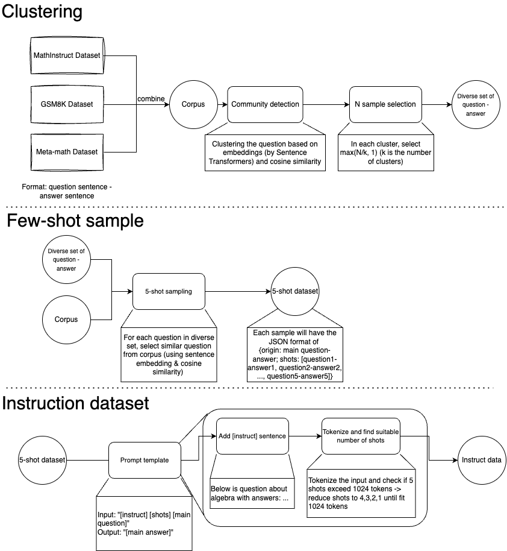

# Pipeline of creating data for Data V5



## Clustering
In `select_data.py` file, there are different domain set and their number of desired sample. Uncomment the target set and run the python command to receive the output and **comment other unused set**.

```python
# MATH set, num_sample=10K
# python select_data.py -n 20000 --cluster_path data/math_cluster.json --sample_question_path data/math_question.jsonl
# Result: Sample 12733 documents.
setattr(args, 'domain_data_paths',[
    ['gsm8k','question', 'answer', ["main"], {"split":"train"}], 
    ['math_qa','Problem', 'correct',[], {"split":"train"}], 
    ['math-eval/TAL-SCQ5K','problem', 'answer_value', [], {'data_dir':"TAL-SCQ5K-EN","split":"train"}],
    ['meta-math/MetaMathQA', 'query', 'response', [], {}],
    ['TIGER-Lab/MathInstruct', 'instruction', 'output', [], {"split":"train"}]
])
setattr(args, 'cache_dir', 'cache/math')
setattr(args, 'force_rebuild', {"corpus_embeddings": False, "cluster": False})
```

## Few-shot sample
In `few_shot_sample.py`, select the appropriate domain by setting at line 80

```python
domain = 'complexqa1' # math, science, cnn, complexqa, bigbench, complexqa1
```

## Instruction dataset
1. Run `fewshot_to_prompt.py` for math and science domains.

```bash
python fewshot_to_prompt.py --domain math --dir data/few-shot
python fewshot_to_prompt.py --domain science --dir data/few-shot
```

2. Change directory to `prompt_design` and run the other domains.

**NOTE**: Update the Tokenizer to the correct tokenizer.

```python
ckpt = Path("/lit-gpt/checkpoints/meta-llama/Llama-2-7b-hf")
tokenizer = Tokenizer(ckpt)
```

```bash
cd prompt_design
cp ../data/few-shot/cnn_fewshot.jsonl .
python cnn.py
cp ../science_fintune.jsonl .
python math_science.py
# change the domain of math_science.py to math
cp ../math_fintune.jsonl .
python math_science.py
```

3. The result will be JSONL files of domains. Directory to a pre-built V5 dataset is at `/lustre/scratch/client/scratch/llm_opt_neurips/datasets/synthetic/v5`. Please move the JSON file to the correct directory in order to use the script correctly.

- `raw_data` is the instruct text dataset in JSONL format
- `tokenized` is the tokenized version. To create this tokenized dataset, use the `lit-gpt/scripts/prepare_synthetic`

    In the `prepare_synthetic.py`, update the path to use the correct Tokenizer and data. 
    ```python
    DESTINATION_PATH = Path("data/synthetic/v2/tokenized/Mistral")
    INPUT_DATA_PATH = Path("data/synthetic/v2/raw_data")
    CHECKPOINT_DIR = Path("checkpoints/mistralai/Mistral-7B-v0.1")
    ```

    Update to use the correct domain and file path
    ```python
    if model == 'mistral':
        domains = ['mistral_chat', 'cnn', 'math', 'science']
    else:
        domains = ['chat', 'cnn', 'math', 'science']

    for domain in domains:
        print(f"Loading {domain} domain ...")
        with open(input_data_path / f'{domain}_prompt_data.jsonl', "r", encoding="utf-8") as fin:
            for line in tqdm(fin):
                data_train.append(json.loads(line))
    ```

## Conversation data

```text
User: <User command 1>
Bot: <Bot response 1>
User: <User command 2>
Bot: <Bot response 2>
```

Convert the above conversation into seq2seq data using pre-defined template.
```text
{'Input': '<Role user><User command 1><Role bot><Bot response 1><Role user><User command 2><Role bot>', 'Output': '<Bot response 2>'}
```

1. To prepare the data, first download `2023-04-12_oasst_ready.trees.jsonl` and put in the same directory of `prepare_chat.py`. Run `prepare_chat.py` to convert trees of conversation into list of conversation.

2. Run `chat_2_seq2seq.py` to convert list of conversation into Seq2Seq data (a.k.a. instruct dataset like other domains).

3. Move to `prompt_design` and run `chat.py` (**NOTE: update the suitable Tokenizer**) to check for valid length (1024 tokens). 

4. Use `prepare_synthetic.py` like other domains to tokenize.

## Training
Use the `.pt` file created by `prepare_synthetic.py` to train using `lit-gpt` framework as the [tutorial](https://github.com/TokisakiKurumi2001/lit-gpt/blob/main/tutorials/neurips_challenge_quickstart.md).